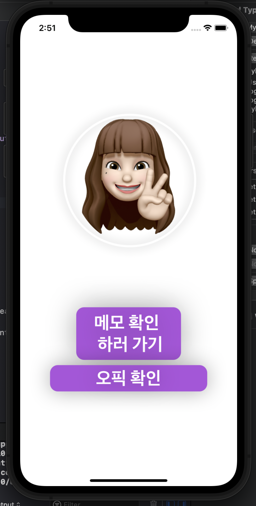
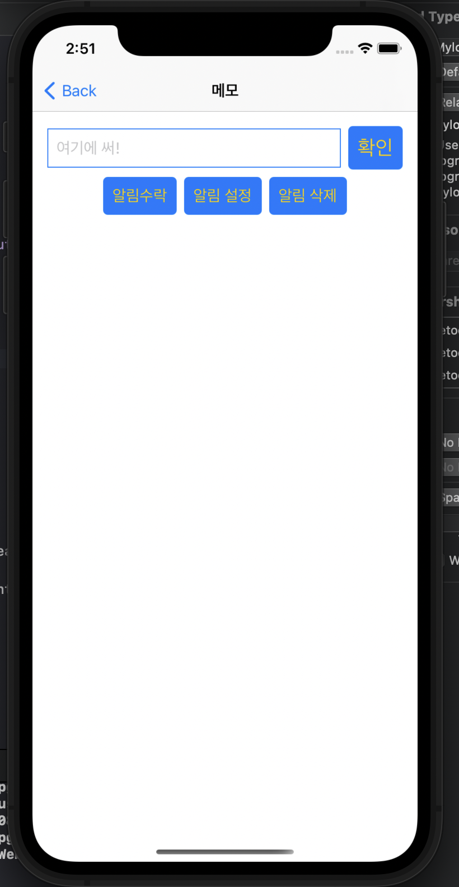
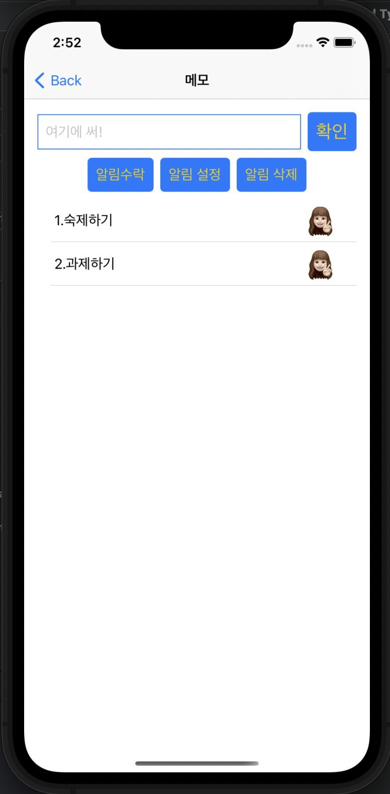
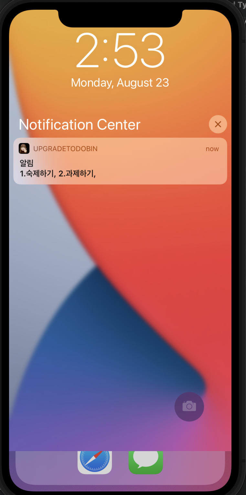

---
* ###  Description
메모한 내용을 알림으로 계속해서 상기시켜 주는 메모 앱. 추가 기능으로 그날의 날씨에 따라 우산을 챙겨야 하는지 여부를 알림으로 알려주는 기능 구현 중.
* ### File
* SwiftUIView.swift
* ContentView.swift
* Myrealmdata.swift
* Mywebview.swift
* MylocalNotify.swift
* swiswon.swift
* Weather.swift
* ###  How to use

* 왼쪽부터 메인 화면은 메모 기능과 오픽 사이트로 가는 버튼 오픽 사이트는 웹뷰로 이어짐
* 메모창은 앱을 껐다 켜도 자신이 메모한 것이 그대로 유지됨
* 메모를 자유롭게 남기고 만약 알림 설정을 하고 싶다면 자신이 원하는 항목들을 터치 후 알림 설정을 누르면 알림이 예약됨. (알림 수락은 최초에 알림 설정을 위한 권한을 수락하는 버튼)
* 시간은 1분으로 맞춰져 있으면 배포할 때는 시간을 자유롭게 선택하도록 구현할 예정
